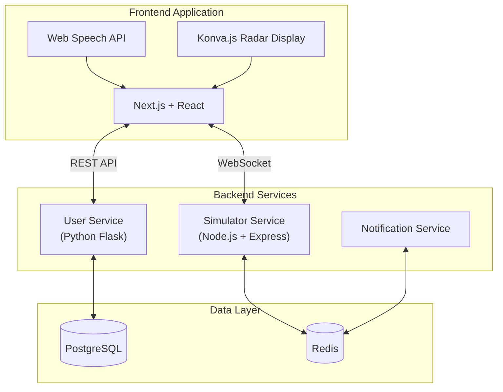
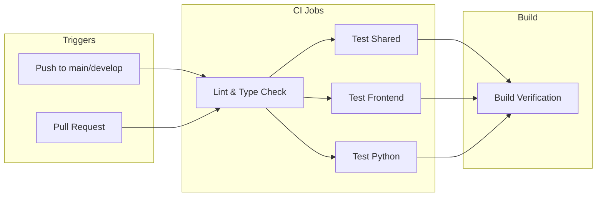

# SkyOps - Air Traffic Control Radar Simulation Training System

A comprehensive Air Traffic Control (ATC) radar simulation platform designed for professional training purposes. This system provides real-time radar display, voice command recognition, and performance analytics for ATC training.

## Table of Contents

- [Features](#features)
- [Architecture](#architecture)
- [Technology Stack](#technology-stack)
- [Getting Started](#getting-started)
- [Testing](#testing)
- [CI/CD Pipeline](#cicd-pipeline)
- [Project Structure](#project-structure)
- [License](#license)

---

## Features

- Real-time radar display with aircraft tracking
- Voice recognition for ATC commands using Web Speech API
- Separation monitoring and conflict detection
- Session replay and training history
- Command parsing (D120, C90, IS250, RM0.78, etc.)
- Audio feedback system
- Multi-user support with JWT authentication
- Training performance analytics

---

## Architecture



### Microservices Overview

| Service | Technology | Responsibilities |
|---------|------------|------------------|
| **Simulator Service** | Node.js, Express, Socket.io | Core ATC simulation logic, real-time aircraft tracking, command parsing, collision detection |
| **User Service** | Python, Flask | User registration, JWT authentication, profile management, training history |
| **Notification Service** | Node.js | Asynchronous events, alerts, email notifications |

---

## Technology Stack

### Frontend
| Technology | Purpose |
|------------|---------|
| Next.js 16+ | React framework with SSR |
| React 19 | UI component library |
| TypeScript | Type-safe development |
| Tailwind CSS | Utility-first styling |
| Konva.js | Canvas-based radar rendering |
| Zustand | State management |
| Socket.io Client | Real-time communication |

### Backend
| Technology | Purpose |
|------------|---------|
| Node.js + Express | Simulator service runtime |
| Python Flask | User service runtime |
| Socket.io | WebSocket communication |
| PostgreSQL | Primary database |
| Redis | Message queue and caching |
| JWT | Authentication tokens |

---

## Getting Started

### Prerequisites

> [!IMPORTANT]
> Ensure the following dependencies are installed before proceeding.

- Node.js 18.0 or higher
- Python 3.9 or higher
- PostgreSQL 14 or higher
- Redis 6 or higher
- npm 9 or higher

### Installation

1. **Clone the repository**
   ```bash
   git clone https://github.com/SkyOps-Application/SkyOps-web-app-version
   cd SkyOps-web-app-version
   ```

2. **Install dependencies**
   ```bash
   cd atc-radar-sim
   npm install
   ```

3. **Build the shared package**
   ```bash
   npm run build --workspace=shared
   ```

4. **Configure environment variables**
   ```bash
   cp frontend/env.example frontend/.env.local
   cp backend/env.example backend/.env
   ```

5. **Start development servers**
   ```bash
   npm run dev
   ```

> [!TIP]
> The frontend runs on `http://localhost:3001` and the simulator backend on `http://localhost:4000`.

### Running the User Service

```bash
cd atc-radar-sim/backend/user_service
pip install -r requirements.txt
python app.py
```

> [!NOTE]
> The User Service runs on `http://localhost:5001` by default.
>

### Running application with Docker

```bash
docker-compose up -d --build
```

---

## Testing

This project includes comprehensive unit tests across all services.

### Shared Package Tests

```bash
cd atc-radar-sim/shared
npm test
```

Tests cover coordinate calculations, distance algorithms, and aviation validation utilities.

### Frontend Tests

```bash
cd atc-radar-sim/frontend
npm test
```

### Python User Service Tests

```bash
cd atc-radar-sim/backend/user_service
pip install -r requirements.txt
pytest tests/ -v
```

> [!TIP]
> Run `npm test -- --coverage` to generate code coverage reports.

---

## CI/CD Pipeline

The project uses GitHub Actions for continuous integration and deployment.



### Pipeline Jobs

| Job | Description |
|-----|-------------|
| **Lint** | ESLint and TypeScript type checking |
| **Test Shared** | Jest tests for shared utilities |
| **Test Frontend** | Jest tests with React Testing Library |
| **Test Python** | Pytest for User Service |
| **Build** | Production build verification |

> [!CAUTION]
> All tests must pass before merging to the `main` branch.

---

## Project Structure

```
SkyOps-web-app-version/
├── .github/
│   └── workflows/
│       └── ci.yml              # GitHub Actions CI/CD
├── atc-radar-sim/
│   ├── frontend/               # Next.js application
│   │   ├── app/                # Next.js app router pages
│   │   ├── components/         # React components
│   │   ├── lib/                # Utilities and store
│   │   ├── hooks/              # Custom React hooks
│   │   └── __tests__/          # Frontend tests
│   ├── backend/
│   │   ├── simulator_service/  # Node.js radar simulation
│   │   ├── user_service/       # Python Flask authentication
│   │   │   └── tests/          # Python tests
│   │   └── notification_service/
│   ├── shared/                 # Shared types and utilities
│   │   ├── src/
│   │   │   ├── types/          # TypeScript interfaces
│   │   │   ├── utils/          # Coordinate and validation utils
│   │   │   └── data/           # Static data (waypoints, exercises)
│   │   └── __tests__/          # Shared package tests
│   └── package.json            # Root workspace configuration
└── README.md
```

---

## License

This project is licensed under the MIT License. See the LICENSE file for details.
